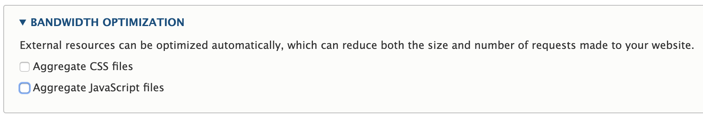
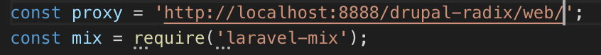

# Drupal 8 + Radix


Project to implement [Radix](https://www.drupal.org/project/radix) module in Drupal 8.x

## Installation
1. Install [Components](https://www.drupal.org/project/components) module
```
composer require drupal/components
```

2. Install [Radix](https://www.drupal.org/project/radix) module
```
composer require drupal/radix
```

## Setting Up Radix
1. Install the Components module from the Extend Page (/admin/modules)

2. Install the Radix theme from the Appareance Page (/admin/appearance)

    Once it is installed, you can use new drush commands
    ```
    drush radix --help
    ```

3. Create a new subtheme
```
drush radix "<subtheme-name>"
```

4. Once the subtheme is created, create a new folder inside the `themes` folder called "custom"
```
mkdir web/themes/custom
```

5. Move the new subtheme inside the new folder
```
mv web/themes/<subtheme-name> web/themes/custom/
```

6. Go to the Appearance page (/admin/appearance) and install the new subtheme and set it by default 


7. Go to Performance page (/admin/config/development/performance) and uncheck both options about Aggregate CSS and Javascript Files 




8. From the Terminal, go to the subtheme folder and install the dependecienes
```
cd web/themes/custom/<subtheme-name>/
npm install
```

9. Compile and minify the JavaScript and Sass files 
```
npm run dev
```

10. The blocks are not well organized by default, so we have to put them in the right region

    ### Add Blocks to the Right Region
- Go to the Block Layout Page (/admin/structure/block)
- Assign the blocks as follows:

    <br>

    <table>
        <tr>
            <th>Region</th>
            <th>Block</th>
        </tr>
        <tr>
            <td>Navbar branding</td>
            <td>Site branding</td>
        </tr>
        <tr>
            <td>Navbar left</td>
            <td>Main navigation</td>
        </tr>
        <tr>
            <td>Navbar right</td>
            <td>User account menu</td>
        </tr>
        <tr>
            <td rowspan="6">Header</td>
            <td>Status messages</td>
        </tr>
        <tr>
            <td>Breadcrumbs</td>
        </tr>
        <tr>
            <td>Help</td>
        </tr>
        <tr>
            <td>Page title</td>
        </tr>
        <tr>
            <td>Tabs</td>
        </tr>
        <tr>
            <td>Primary admin actions</td>
        </tr>
        <tr>
            <td>Content</td>
            <td>Main page content</td>
        </tr>
        <tr>
            <td rowspan="2">Footer</td>
            <td>Footer menu</td>
        </tr>
        <tr>
            <td>Powered by Drupal</td>
        </tr>
    </table>

11. In order to see the style changes in real time change the proxy in the `webpack.mix.js` file 


12. Now, run the project with `watch` command to see the changes in real time
```
npm run watch
```

13. Install the [Radix Layouts](https://www.drupal.org/project/radix_layouts) module that ships with a lot of layouts to use.
```
composer require drupal/radix_layouts
```

## Troubleshoothing

### 1.  Twig module  
If this Exception is not allowing you to see the Drupal inital page: 
```
Uncaught PHP Exception Twig\Error\SyntaxError: "An exception has been thrown during the compilation of a template ("Node "options" does not exist for Node "Drupal\Core\Template\TwigNodeTrans".") in "core/themes/bartik/templates/block--system-menu-block.html.twig"." at /Applications/MAMP/htdocs/<project-name>/vendor/twig/twig/src/Environment.php line 798
```

Update the composer.json file with :
```
"conflict": {
    "drupal/drupal": "*",
    "twig/twig": "^1.40.0"
},
```

and run
```
composer update
```